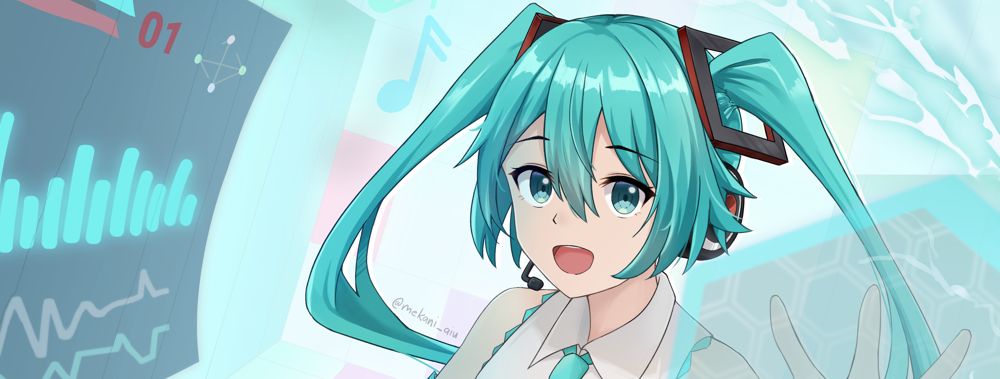
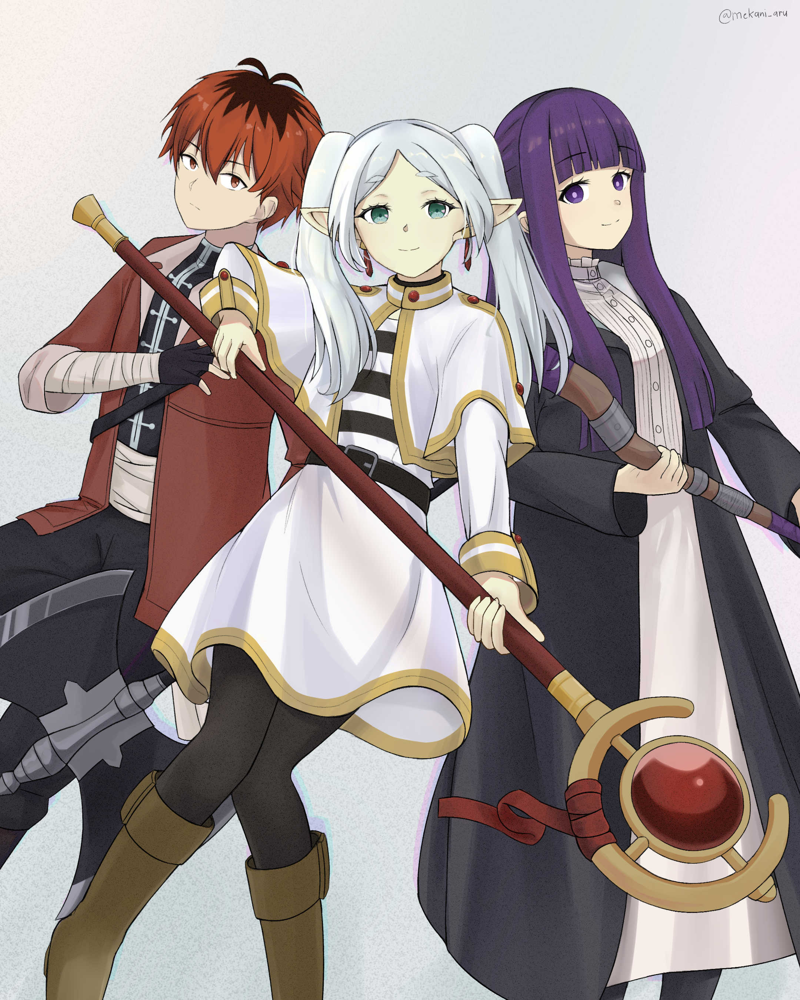

  

  

<h1 align="center">Jerowe Tan (mekænix) 👋</h1>

<h3 align="center">Software Engineer · Cloud Architect</h3>

  Fueled by passion and strived to learn. 
  Currently at <strong>Toyota</strong>, with focus on reliable systems and business application.

  
  
  

---

## Tech Stack

### Frontend

  
  
  
  
  
  
  
  
  
  
  

### Backend

  
  
  
  
  
  
  
  
  
  
  
  
  
  
  
  
  
  
  

### AI

  
  
  
  
  
  
  
  

### Cloud

  
  
  
  
  
  
  
  

### Tools / Environment

  
  
  
  
  
  
  
  
  
  
  
  

---

## Things I Build

- **Cloud-ready starters** — [Astro + Cloudflare template](https://github.com/JeroTan/astro-cloudflare-starter-template) for fast project setup.
- **Developer and productivity tools** — [JSArmyKnife](https://github.com/JeroTan/JSArmyKnife), [Fetch Man](https://github.com/JeroTan/fetch-man), and [Musifier2](https://github.com/JeroTan/Musifier2).
- **Local AI tools** — [Voice Revolver AI](https://github.com/JeroTan/voice-revolver-local-ai) for voice cloning, vocal replacement, and audio workflows.
- **Web games** — [Snake](https://github.com/JeroTan/Snake) and [Orthographic Car](https://github.com/JeroTan/orthographic-car).

---

  

---

## Pinned Repositories

<table>
  <tr>
    <td width="50%" valign="top">
      <h3><a href="https://github.com/JeroTan/astro-cloudflare-starter-template">astro-cloudflare-starter-template</a></h3>
      
Astro starter for deploying to Cloudflare Workers.

      TypeScript
    </td>
    <td width="50%" valign="top">
      <h3><a href="https://github.com/JeroTan/voice-revolver-local-ai">Voice Revolver AI</a></h3>
      
Local AI audio workstation for voice cloning, vocal replacement, and custom voice training.

      Python
    </td>
  </tr>
  <tr>
    <td width="50%" valign="top">
      <h3><a href="https://github.com/JeroTan/ECJersey">ECJersey</a></h3>
      
React e-commerce jersey storefront mockup.

      JavaScript
    </td>
    <td width="50%" valign="top">
      <h3><a href="https://github.com/JeroTan/JSArmyKnife">JSArmyKnife</a></h3>
      
Starter template for building JavaScript applications.

      TypeScript
    </td>
  </tr>
  <tr>
    <td width="50%" valign="top">
      <h3><a href="https://github.com/JeroTan/musifier-version-2">musifier-version-2</a></h3>
      
Music project migrated to Astro.

      JavaScript
    </td>
    <td width="50%" valign="top">
      <h3><a href="https://github.com/JeroTan/Snake">Snake</a></h3>
      
Classic browser-based Snake game.

      HTML
    </td>
  </tr>
  <tr>
    <td width="50%" valign="top">
      <h3><a href="https://github.com/JeroTan/novel-writer-english">novel-writer-english</a></h3>
      
English novel-writing skill workflow for AI coding agents.

      JavaScript
    </td>
    <td width="50%" valign="top">
      <h3><a href="https://github.com/JeroTan/jrw-webapp">jrw-webapp</a></h3>
      
Clothing e-commerce web application.

      TypeScript
    </td>
  </tr>
</table>

---

## Contribution Graph

  

---

## Outside of Code

Some of my work of art. . .

  
  
  
  

 

  

